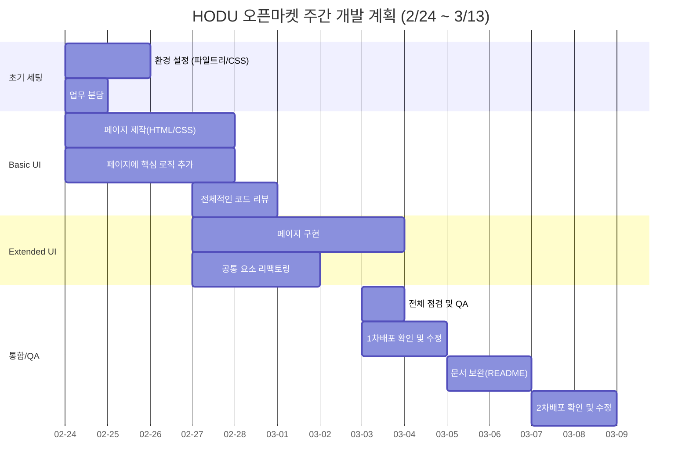

# Study-In-03

> **Study-In Service**
>
> StudyIn은 스터디를 생성하고, 참가하고, 소통할 수 있는 스터디 매칭 서비스입니다.
> 사용자는 스터디 생성 / 수정 / 삭제, 스터디 참가 / 탈퇴, 댓글 작성, 실시간 채팅 (WebSocket), AI 기반 커리큘럼 & 소개글 자동 생성, 프로필 관리, JWT 기반 로그인 인증을 할 수 있습니다.

## 1. 프로젝트 개요

- **프로젝트명**: Study-In-03
- **개발 기간**: 2026.02.24 ~ 2026.03.13
- **개발 인원**: Front-End 6기 6명 (Team Project)
- **배포주소**:
- **Test Account**

  
- **개발 일정 (WBS)**



## 2. 기술 스택 (Tech Stack)

| 구분                    | 기술                                                                                                                                                                                                      | 설명                                 |
| :-------------------- | :------------------------------------------------------------------------------------------------------------------------------------------------------------------------------------------------------ | :--------------------------------- |
| **Core**              |   | 컴포넌트 기반 SPA 개발 및 정적 타입 안정성 확보      |
| **Routing**           |                                                                                            | SPA 환경에서 Public / Private Route 분리 |
| **Styling**           |                                                                                                | 유틸리티 퍼스트 기반 디자인 시스템 구축             |
| **State Management**  |                                                                                                           | 인증 상태, 알림, 모달 등 전역 상태 관리           |
| **API Communication** |                                                                                                             | 인터셉터 기반 JWT 자동 주입 및 토큰 갱신 처리       |
| **Real-time**         |                                                                                                   | 실시간 채팅 기능 구현                       |
| **AI Integration**    |                                                                                                      | AI 기반 커리큘럼 및 소개글 자동 생성 (스트리밍 처리)   |
| **Build Tool** |                  | 빠른 HMR 및 번들링 최적화                       |
| **Deploy**     |  | Firebase CLI 기반 정적 배포 및 SPA rewrite 설정 |


---

## 3. 프로젝트 실행 방법

  ### 1. 저장소 클론
  
git clone https://github.com/Study-In-03/Study-In.git

 ### 2. 패키지 설치
  npm install

  ### 3. 환경 변수 설정
  .env 파일 생성 후 아래 내용 추가

    VITE_BASE_URL=https://api.studyin.com :
    VITE_CHAT_URL=wss://api.studyin.com/ws :
    
  ### 4. 실행
  npm run dev

## 4. 프로젝트 구조
```mermade
 studyin-frontend
├── public/
├── src/
│   ├── api/          # 서버 통신 로직 (Axios 인스턴스, API 함수)
│   ├── components/   # 전역 공통 UI 컴포넌트
│   ├── features/     # 도메인별 기능 모듈 (auth, study, profile 등)
│   ├── hooks/        # 전역 커스텀 훅
│   ├── pages/        # 라우팅과 연결되는 실제 페이지
│   ├── routes/       # Public/Private 라우트 설정
│   ├── store/        # Zustand 전역 상태 관리
│   ├── types/        # TypeScript 타입 정의
│   ├── utils/        # 유틸 함수 모음
│   ├── lib/          # 외부 라이브러리 초기화
│   ├── App.tsx
│   └── main.tsx
end
```

---
## 5. 아키텍쳐 설계 전략

1. Feature 기반 구조 : 기능(도메인) 단위로 폴더를 분리했습니다.
```mermade
features/
 ├── auth/
 ├── study/
 ├── profile/
 ├── comments/
 └── chat/
end
```

 장점: 기능별 응집도 ↑, 유지보수 용이, 팀원 분업이 명확

 2. API 레이어 분리 : Axios 인스턴스 분리, 인터셉터에서 JWT 자동 주입, 401 발생 시 refresh_token 자동 갱신
    
```mermade
api/
 ├── axios.ts 
 ├── auth.ts
 ├── study.ts
 └── chat.ts
end
```
 3. 상태 관리 전략 : 
    상태 유형	관리 방식
    로그인 상태	Zustand
    모달/알림	Zustand
    폼 상태	커스텀 훅
    서버 데이터	API 호출 기반


## 6. 주요 기능 (Key Features)

### 6-1. 회원가입 및 로그인 (Authentication)


#### 6-1-1. JWT기반 인증: 

#### 6-1-2. access_token(1시간):

#### 6-1-3. refrexh_token(7시간):

#### 6-1-4. 이메일 인증 코드 : 123456

#### 6-1-5. 닉네임 중복 검사 API 연동:


### 6-2. 스터디 CRUD


#### 6-2-1. 스터디 생성:

#### 6-2-2. 수정:

#### 6-2-3. 삭제(스터디장만 가능):

#### 6-2-4. 상세조회:

#### 6-2-5. 페이지네이션 지원:


### 6-3. AI 기능

#### 6-3-1. 커리큘럼 자동 생성:

#### 6-3-2. 스터디 소개글 자동 생성:

#### 6-3-3. 스트리밍 응답 처리:

#### 6-3-4. 로딩 스피너 표시:

#### 6-3-5. 기존 내용 덮어쓰기 전 확인 모달:


### 6-4. 실시간 채팅(WebSocket):


#### 6-4-1. JWT 토큰을 쿼리 파라미터로 전달:

#### 6-4-2. 메시지 타입:
##### text
##### image
##### file
##### notice

#### 6-4-3. 입/퇴장 시 시스템 메시지 자동 생성:

#### 6-4-4. 매일 자정 채팅 기록 초기화:


### 6-5. 좋아요 (필수:UI 토글)

#### 6-5-1.하트 버튼 색상 변경:

#### 6-5-2. 선택 과제 : 관심 스터디 목록 조회:

### 6-6. 프로필 기능:

#### 6-6-1. 준회원 -> 정회원 전환:

#### 6-6-2. 닉네임 중복 검사:

#### 6-6-3. 선호 지역 선택:

#### 6-6-4. 관심 태그 다중 선택:

---

## 7. 기능 시연 (Preview) 및 역할 분담

서비스의 핵심 기능을 **GIF**로 확인하실 수 있습니다.(발표용 PPR자료에서는 움짤+설명, 추가기능에대해서는 다른색으로 설명추가예정)

(예)### 7-1-1. 메인 페이지 (Main Page)
각 페이지에 대한 설명
</>
<br/>

---


### 7-1. 역할 분담
| 이름 | 담당 영역           |
| -- | --------------- |
| 수민 | Auth, WebSocket |
| 외숙 | 메인 피드, 채팅 UI    |
| 수정 | 스터디 상세, 좋아요     |
| 주현 | 스터디 생성, AI      |
| 하리 | 프로필             |
| 서원 | 댓글, 업로드         |

---

## 8. 트러블 슈팅

### 8-1. JWT 자동 갱신 문제

##### 401 에러 발생 시 refresh요청:

##### 동시 요청 race condition 방지:


### 8-2. WebSocket 재연결 문제

##### ping-pong 구현:

##### 연결 끊어질 경우 재시도 로직 적용:

### 8-3. FormData 파일 업로드 이슈

##### multipart/form-data 헤더 설정:

##### 이미지 자동 리사이징 대응:


---

## 9. 향후 개선 사항
### 무한 스크롤 적용
### AI 프롬프트 고도화
### 테스트 코드 작성
### 성능 최적화(Reactmemo, Suspense)
### 접근성(A11y) 개선

## 10. 팀원 정보 및 회고

- **이름**: 강수민 (팀장)
- **역할**: 
- **GitHub**: 
- **Email**:
- **회고**:

> 

<br/>

- **이름**: 강수정 (팀원)
- **역할**:  
- **GitHub**:  
- **Email**: 
- **회고**:

>
> <br/>

- **이름**:  강지현 (팀원)
- **역할**:  
- **GitHub**:  
- **Email**: 
- **회고**:

>  

<br/>

- **이름**: 권하리 (팀원)
- **역할**:  
- **GitHub**:  
- **Email**: 
- **회고**:

>  

<br/>

- **이름**: 박외숙 (팀원)
- **역할**:  
- **GitHub**:  
- **Email**: 
- **회고**:

>  

<br/>

- **이름**: 최서원 (팀원)
- **역할**:  
- **GitHub**:  
- **Email**: 
- **회고**:

>  


---